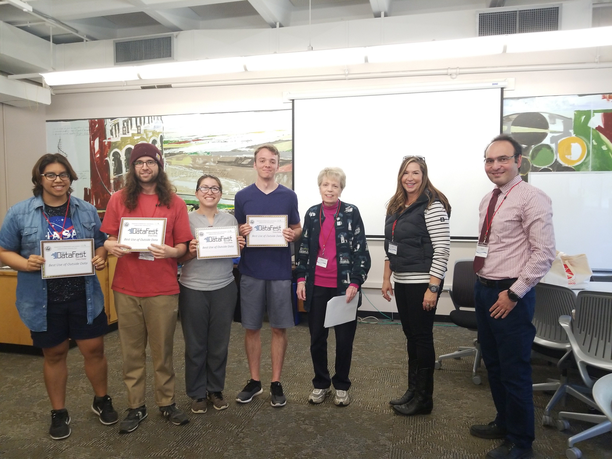
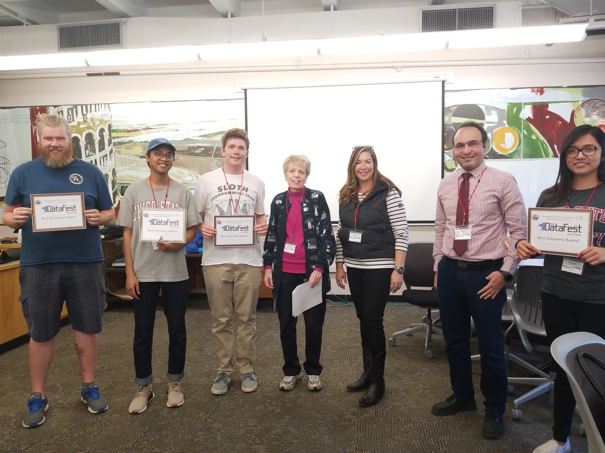

# Past Events:

## DataFest 2018
Our first year saw 12 undergraduate students from Applied Mathematics, Statistics, but also Computer Science, Construction Management, Civil Engineering, and Biology. The diversity of backgrounds and experiences was amazing. Many students were buzzing afterwards about how much fun they had and how much they learned that weekend.

After two days of intense data wrangling, analysis, presentation design, interspersed with a lot of good free food and caffeine, each team presented their findings to a panel of judges consisting of both on and off campus professionals. Over $500 worth of prizes were given for Best in Show, Best Visualization, and Best Use of External

###Best Use of Outside Data

###Best Visualization

###Judges Choice and Best Discovery 

