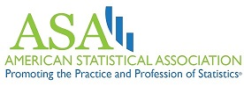
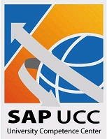

# Supporting Data Fest

As our event grows we will need more help from the North State Community to put this fabulous event on. 
How can you support DataFest at Chico State?

## Consider participating as a Visiting Consultant / Mentor

Spend an hour or two getting to know the students and offering your sage advice. 
This is an excellent recruiting opportunity; you get to watch students working in teams, under pressure, striving to understand possibly the most complex data set they have encountered. 
At other institutions, students have received internships and interviews that have led to full-time employment. 
Success at DataFest requires that a team have a combination of computational, statistical, and human skills, as well as the ability to communicate clearly and extremely concisely.

[[Click here!]](https://docs.google.com/forms/d/e/1FAIpQLSf6lrnab-gm-ds5xsi8Ss5j3E-ZTUc0ipSNQYOEvSzRbkoKhw/viewform) to sign up as a mentor, or contact Robin Donatello at rdonatello@csuchico.edu for more information. 

## Financial Contributions

We welcome financial donations from individuals and businesses. Donations are used to provide food, prizes, and supplies. We are seeking to raise $2000 for the 2018 event. 

Contact Robin Donatello, rdonatello@csuchico.edu for more information on how to give. 

## Swag

Pens, note pads, USB drives, buttons... Students love these and they help make the event fun. If we get something special, we can give it away in a “midnight raffle” to help keep the energy level high.

---

# 2018 Sponsors

Data Fest wouldn't be able to happen without the help of these individuals and companies. 

* **The American Statistical Association** is the National coordinating organization. They work hard to get the most interesting data possible.     

* **Data Camp** is offering a free one-month trial membership (access to all their courses) for DataFest participants.
  

* **SAP University Competence Center (SAP-UCC)**  
Providing refreshments and prizes.     

* **CESR (Center for Enterprise Systems and Informatics Research)**   
[[link to the website]](http://www.csuchico.edu/cob/students/beyond-classroom/cesir.shtml)

